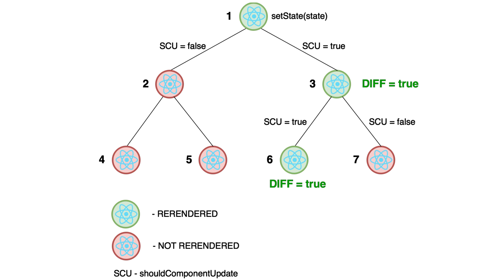
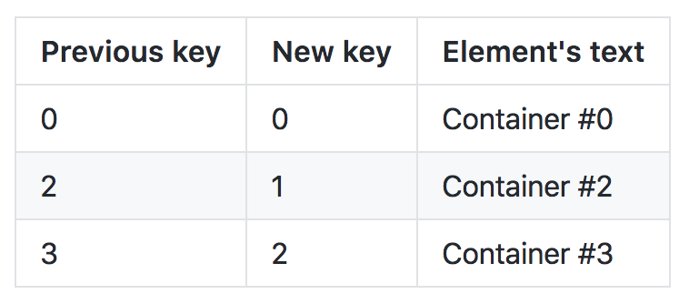

Everybody, everywhere and every time wants to get the fastest response from the application that he or she uses. It's humanity's nature, we are not the most patient creatures all over the galaxy. That's why I'm here. My wish is to show how to make your app be the best friend of every user. All the materials for this post are given from my public talk at GDG IWD 2018 Kyrgyzstan, Bishkek and can be found [<b>here</b>](https://github.com/teimurjan/react-optimization-presentation).

## Optimization types

Before the start, we need to identify the areas which may be improved. First of all, we are talking about the javascript app which we build as the one bundle file. So as the beginning we need to make this file as small as possible to reduce the web page's loading time. The next and final step is to avoid redundant re-rendering of the components.

* Reduce `bundle.js`
* Avoid least calls of `render()`

## Bundle size

### CSS

The first thing we can do is to extract our CSS from our bundle. The use of this method is to make `css` an `js` bundles loading in parallel. Fortunately, there is a webpack plugin that allows doing that very easily.

```js
const ExtractTextPlugin = require("extract-text-webpack-plugin");

module.exports = {
  module: {
    rules: [
      {
        oneOf: [
          {
            test: /\.css$/,
            loader: ExtractTextPlugin.extract({
              /* your loader here */
            })
          }
        ]
      }
    ]
  }
};
```

Now we've done with extracting `css` file. As the last step with CSS let's minify this file by providing an option to css-loader.

```js
loader: ExtractTextPlugin.extract({
  use: [
    {
      loader: require.resolve("css-loader"),
      options: {
        minimize: true
      }
    }
  ]
});
```
By these simple actions, we could divide one big bundle into two smaller ones and then reduce the CSS file's size by about 25%.

### JS size reduction

Now it's a more interesting part as we'll talk about JS bundle optimization. Here I suggest, beginning with the setting environment variable `NODE_ENV=production`. Why do we need to do that? Because without knowing that we are in production React will be using its development file which is 7 times greater than the minified one for production.

```js
const webpack = require("webpack");

module.exports = {
  plugins: [
    new webpack.DefinePlugin({
      "process.env": {
        NODE_ENV: JSON.stringify("production")
      }
    })
  ]
};
```

File with React.js library is ready for use, but what's with our own code? How to make it minified? UglifyJsPlugin is our assistant in solving this problem. This plugin reduces the bundle's size for about 47%! 🙀

```js
const webpack = require("webpack");

module.exports = {
  plugins: [
    new webpack.optimize.UglifyJsPlugin({
      /* settings */
    })
  ]
};
```

### Analysis

Suppose that you've done everything written earlier but your problems have not dissapeared. In that case we might need to abandon some libraries. To detect useless and heavy libraries we can use 2 popular tools:

* source-map-explorer(needs a source map file)

```sh
npm install -g source-map-explorer
source-map-explorer bundle.js bundle.js.map
```

* webpack-bundle-analyzer(run as a local app after each webpack build)

```js
const BundleAnalyzerPlugin = require("webpack-bundle-analyzer")
  .BundleAnalyzerPlugin;

module.exports = {
  plugins: [new BundleAnalyzerPlugin()]
};
```

These tools are similar but in my opinion, the last one is more nice-looking.

### Code splitting

So all the least dependencies are removed but you want more and more optimization. That's where code splitting steps in! First of all, we need to divide our clients and dependencies' code. It will be a very useful act if you often update your code but the libraries remain the same because the browser will not update the cached libraries' bundle.

```js
const webpack = require("webpack");

module.exports = {
  entry: {
    client: "./src/index.js",
    vendor: ["react", "react-dom", "react-router", "react-router-dom"]
  },
  plugins: [
    new webpack.optimize.CommonsChunkPlugin({
      name: "vendor",
      filename: "vendor.[chunkhash].js"
    })
  ]
};
```

In this example, we extracted from the main bundle some vendors like react(-dom), react-router(-dom).
 
But we'll not stop at this point as we can divide our main bundle further and further using route-based code splitting. This way of optimization requires changing not only the configs but also the code.
At first, let's edit webpack's output settings.

```js
const webpack = require("webpack");
const path = require("path");

const buildPath = path.resolve("build");

module.exports = {
  output: {
    path: buildPath,
    filename: "[name].[chunkhash:8].js",
    chunkFilename: "[name].[chunkhash:8].chunk.js"
  }
};
```

Now we should choose the component to be extracted into a chunk.

```js
// home.js
import React from "react";

export default () => (
  <div className="wrapper">
    <h2>Home</h2>
  </div>
);
```

The only thing to make chunking work is to wrap our component in a [react-loadable](https://github.com/jamiebuilds/react-loadable) component.

```js
// home-container.js
import Loadable from "react-loadable";
import Spinner from "../Common/Spinner";

export default Loadable({
  loader: () => import("./Home" /*webpackChunkName: 'home' */),
  loading: Spinner
});
```

At this moment we can use this container to load the Home component as a separate file.

## React

Lastly, we finished bundle's size reduction and could move to our React.js code.

### Reconciliation

To optimize something, we have to know how it's working. So, one of the main things affecting performance is reconciliation.
Reconciliation is an algorithm of updating React's Virtual DOM. Here is a simple scheme illustrating how it works.



We have a state update in the root component - (1). Consider this update as a signal. The signal goes deeper to the (1)'s children. (2)'s SCU method returns `false`, so this component and all his children will ignore this signal. As for the (3), its SCU returns `true` then it will handle the signal(it will be re-rendered if React's comparison algorithm will find differences between us and current nodes) and pass the signal deeper. Child (6)'s SCU also returns `true` and React also find here some differences. (6) will be re-rendered. (7)'s SCU result is `false`, then no re-render needed.

That's how React's updates work. As you notice `shouldComponentUpdate` plays a huge role in this process. Here is how default SCU looks like:

```js
export default class extends React.Component {
  shouldComponentUpdate(nextProps, nextState) {
    return true;
  }
}
```

It means that your component will always handle pass the update signal.
To avoid this, React.PureComponent can be used. This thing is a copy of React.Component but with one significant change. It has different realization of `shouldComponentUpdate` method.

```js
export default class extends React.PureComponent {
  shouldComponentUpdate(nextProps, nextState) {
    return !(
      shallowEqual(nextProps, this.props) && shallowEqual(nextState, this.state)
    );
  }
}
```

Next and previous props/state are compared by shallowEqual which works like:

```js
const arr1 = [1, 2, 3];
const arr2 = [1, 2, 3];

arr1 === arr2; // false

const obj1 = { foo: "bar" };
const obj2 = { foo: "bar" };

obj1 === obj2; // false
```

As you see having the same content does not mean shallow equality. arr1/obj1 and arr2/obj2 are just the pointers to the values located in your machine's memory. So when the device takes arr1 and arr2 pointers' values, they are from different locations. That's why they are not shallow equal. And this issue often causes performance drops. I will note 2 the most common mistakes inducing this drops:

* arrow functions and .bind(this) in `render`
* using a constant object in `render`

### Arrow functions and .bind(this)

Why I've mentioned arrow functions and .bind(this)? Suppose you have such todo component:

```js
class Todo extends React.Component {
  render() {
    return (
      <li className="todo" onClick={this.props.onClick}>
        {this.props.todo}
      </li>
    );
  }
}
```

and you use it:

```js
render() {
  return (
    <ul>
      {this.props.todos.map(todo => (
        <Todo todo={todo} onClick={() => this.props.onTodoClick(todo.id)} />
      ))}
    </ul>
  );
}
```

At first sight, all is well, but here is a mistake. When you use `() => this.props.onTodoClick(todo.id)` in such a way, a new function will be created at every call of render. As you know JS functions are objects than as we've seen earlier new object means new location(address) in the memory. That's why our PureComponent will always find differences with the new node. To solve this issue, you may pass `onTodoClick` as a prop and call it inside the Todo component.

```js
class Todo extends React.Component {
  handleClick = e => {
    this.props.onClick(this.props.todo.id);
  };

  render() {
    return (
      <li className="todo" onClick={this.handleClick}>
        {this.props.todo}
      </li>
    );
  }
}

class TodoList extends React.PureComponent {
  render() {
    return (
      <ul>
        {this.props.todos.map(todo => (
          <Todo todo={todo} onClick={this.props.onTodoClick} />
        ))}
      </ul>
    );
  }
}
```

There is the same problem with .bind(this) because this function also creates a new object on every render. So instead of doing this

```js
render() {
    return (
        <ul>
            {this.props.todos.map(todo => (
                <Todo
                    todo={todo}
                    onClick={this.props.handleClick.bind(this)}
                />
            ))}
        </ul>
    );
}
```

you can bind the method in the constructor

```js
constructor(props) {
  super(props);
  this.handleClick = this.handleClick.bind(this);
}
```

or even better use ES6 arrow function(no need to bind context in this way)

```js
handleClick = todoId => {
  this.setState({
    [todoId]: { clicked: true }
  });
};
```

### Constant object in render

There are a lot of components in React which takes different static options as props. For example, we have a todo list that takes options as an object prop.

```js
export default class extends React.PureComponent {
  render() {
    return (
      <TodoList
        options={{
          wrap: false,
          maximizeOnFoucs: true
        }}
      />
    );
  }
}
```

It's not so clear but for every call of render, the options are a newly created object. But as the values are always the same, we can just extract it to a variable.

```js
const TODO_LIST_OPTIONS = {
  wrap: false,
  maximizeOnFoucs: true
};

export default class extends React.PureComponent {
  render() {
    return <TodoList options={TODO_LIST_OPTIONS} />;
  }
}
```

### Components' keys
 
Another most common problem is when the index of an element is used as the key. That's because there are not too many people who know the keys' mission. Keys are like unique ids in a hash map to make operations on them faster. Here is what happens when you use indexes as the keys(I'll represent components schematically).

```js
// You have this 4 components
const elements = [
  { type: "div", key: 0, textContent: "Container #0" },
  { type: "div", key: 1, textContent: "Container #1" },
  { type: "div", key: 2, textContent: "Container #2" },
  { type: "div", key: 3, textContent: "Container #3" }
];

// Delete Container #1
const elements = [
  { type: "div", key: 0, textContent: "Container #0" },
  // Components with text Container #2 and Container #3 has new indexes
  { type: "div", key: 1, textContent: "Container #2" },
  { type: "div", key: 2, textContent: "Container #3" }
];
```

As you see after deletion Container #1 indexes of all the elements after it has changed. In this way, the keys also have changed.



So after deletion, an element at index `n`, all the elements with an index greater than `n` will be re-rendered. Now imagine if you have 1000 elements and you delete the first one. 😅
To handle this issue, you need to use the id of elements as the key. If you don't have id you can generate them when the component is mounting. NOT IN RENDER! Otherwise, the components' keys will be different after every update.

### Avoiding lifecycle

React.js developers say that using stateless(functional) components is a way for optimization but not for now. They are going to implement a component's lifecycle avoidance for these components in the future. But after some discovering, I've found out that it is possible to even for now. You don't need any extra dependencies. You have to call functional components as the functions without mounting them as XML.

```js
const TodoFactory = ({ todo, onClick }) => (
  <li className="todo" onClick={onClick}>
    {todo.title}
  </li>
);

export default ({ todos }) => (
  <ul>{todos.map(todo => TodoFactory({ todo, onClick: console.log }))}</ul>
);
```

Here is [the link](https://github.com/missive/functional-components-benchmark) to benchmark.

## Conclusion

There were explained the most common and efficient methods above. These methods were implemented using `React 16.2`, `Webpack 3.8.1`. But it is not so important as you had to understand the idea and optimization ways, not the implementation. Hope this post answered some of your questions and would be helpful in your future.
